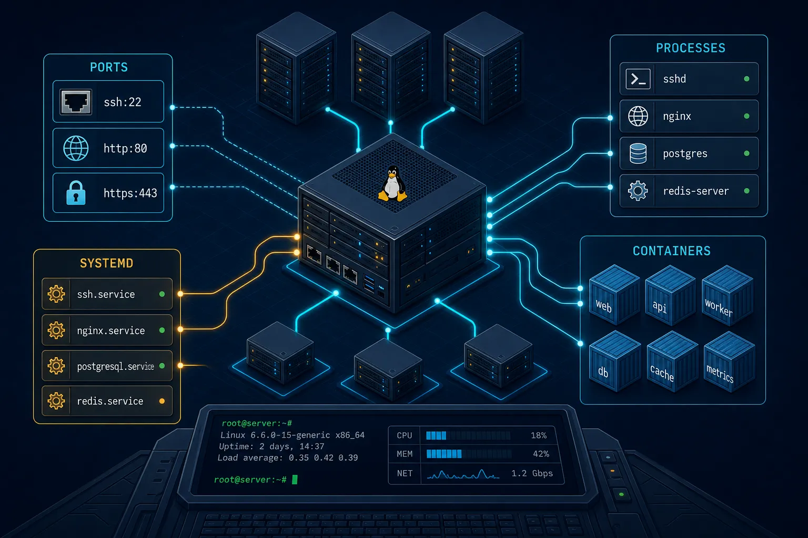
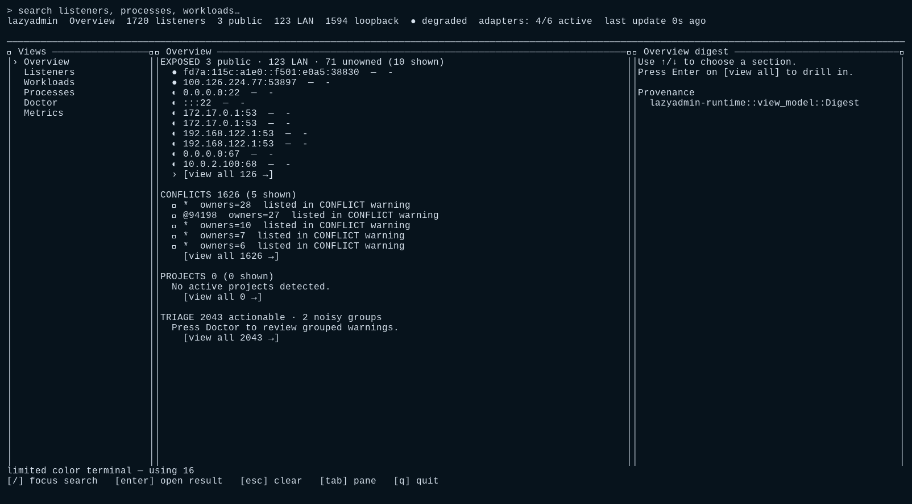

# lazyadmin

> Linux-first local runtime control plane for developers and coding agents.

[](.)
[](#license)

lazyadmin is a local runtime discovery and control tool for Linux. It reads
`/proc`, systemd, and Docker-compatible APIs to show you what is listening on
which ports, which processes own them, and what is safe to do about it.
Built for developers who manage long-running dev servers and for coding
agents that need to inspect and interact with the local runtime safely.

- [Install](#install)
- [Usage](#usage)
  - [TUI](#tui)
  - [CLI](#cli)
  - [Web UI](#web-ui)
- [Configuration](#configuration)
- [Development](#development)
- [Agent integration](#agent-integration)
- [Scope](#scope)
- [Documentation](#documentation)
- [License](#license)

## Install

Requires Rust 1.85+ and a Linux host.

```bash
cargo install --path crates/lazyadmin-cli --locked
```

No daemon or root install is required. After installation:

```bash
lazyadmin --version
lazyadmin 0.4.0
```

## Usage

lazyadmin has three interfaces: a Ratatui TUI, a CLI, and a read-only Web UI.

### TUI

Run `lazyadmin` with no arguments to launch the interactive TUI. For
automation or debugging without entering raw terminal mode:



```bash
lazyadmin tui --headless --json
```

```json
{
  "schema_version": "lazyadmin.tui.headless.v1",
  "layout": {
    "width": 120,
    "mode": "ThreePane"
  },
  "panes": [
    "views",
    "main",
    "inspector"
  ],
  "theme": {
    "name": "default-dark",
    "fallback_palette": "truecolor"
  },
  ...
}
```

Layouts switch at 100, 80, 60, and below-60 columns. Below 60 columns the
TUI refuses and suggests CLI commands. Views include Listeners, Workloads,
Processes, Doctor, Process Tree, Metrics, and search. See
[`docs/tui.md`](docs/tui.md) for keybindings, themes, and sorting.

### CLI

```
Local runtime control plane

Usage: lazyadmin [OPTIONS] [COMMAND]

Commands:
  tui             
  web             
  port            
  free            
  ps              
  public          
  conflicts       
  projects        
  overview        
  logs            
  doctor          
  events          
  export          
  diff            
  search          
  run             
  runs            
  pause-restart   
  resume-restart  
  config          
  help            Print this message or the help of the given subcommand(s)

Options:
      --json                      
      --brief                    
      --config <CONFIG>          
      --log-format <LOG_FORMAT>  [default: text] [possible values: text, json]
  -v, --verbose...               
  -h, --help                     Print help
  -V, --version                  Print version
```

Key workflows:

**Check system health:**

```bash
$ lazyadmin doctor
adapter:portless:
  [OK] state dir /home/shuv/.portless (0 route(s) readable ...)
  [OK] binary (available (0.11.1))
  [OK] orphan routes (0 orphaned route(s))
containers:
  [WARN] Docker socket (Docker socket accessible; this usually grants root-equivalent control of the host)
    hint: Do not chmod the socket or add users to docker group blindly; use targeted action permissions.
processes:
  [OK] /proc (readable)
sockets:
  [OK] /proc/net (readable)
  [OK] ss fallback (available)
systemd:
  [OK] systemctl (available)
  [OK] journalctl (available)
tracked runs:
  [OK] registry (/run/user/1000/lazyadmin/runs writable check)
```

**Export a full system snapshot:**

```bash
$ lazyadmin export --json | head -c 400
{
  "schema_version": "lazyadmin.snapshot.v1",
  "generated_at": "2026-05-14T10:11:35.275592699Z",
  "host": {
    "boot_id": null,
    "hostname": null,
    "kernel": null
  },
  ...
}
```

**Get a high-level overview digest:**

```bash
$ lazyadmin overview --json | head -c 400
{
  "exposed": {
    "rows": [
      {
        "listener_id": "tcp:fd7a:115c:a1e0::f501:e0a5:38830:32493",
        "port": 38830,
        "bind": "fd7a:115c:a1e0::f501:e0a5:38830",
        "exposure": "public",
        ...
      }
    ],
    ...
  },
  ...
}
```

**Compare two snapshots:**

```bash
$ lazyadmin diff before.json after.json --json
{
  "schema_version": "lazyadmin.diff.v1",
  "generated_at": "2026-05-14T10:11:08.686998477Z",
  "listeners": {
    "added": [],
    "removed": [],
    "changed": []
  },
  "workloads": {
    "added": [],
    "removed": [],
    "changed": []
  },
  "owner_changes": [],
  "warning_changes": {
    "added": [],
    "removed": [],
    "changed": []
  },
  "summaries": [
    "listeners: +0 -0 ~0",
    "workloads: +0 -0 ~0"
  ]
}
```

**Explain a port:**

```bash
$ lazyadmin :3000 --json
{
  "schema_version": "lazyadmin.snapshot.v1",
  ...
}
```

**Free a port safely:**

```bash
lazyadmin free 3000
```

`free` validates direct process owners before sending SIGTERM, requires one
consolidated confirmation, rescans after execution, and never escalates to
SIGKILL automatically. See [`docs/action-safety.md`](docs/action-safety.md).

**Track a long-running command:**

```bash
lazyadmin run --tag my-web --detach -- npm run dev
lazyadmin runs --json
lazyadmin run stop tag:my-web
```

**Stream discovery events:**

```bash
$ lazyadmin events --once --json
{"schema_version":"lazyadmin.discovery_event.v1","kind":"heartbeat","adapter":"procfs","timestamp":"2026-05-14T10:11:08.734631837Z"}
```

**Search across all entities:**

```bash
lazyadmin search "myapp" --json
```

### Web UI

Start the read-only Web UI on loopback:

```bash
lazyadmin web --port 7749
```

```
Usage: lazyadmin web [OPTIONS]

Options:
      --bind <BIND>              [default: 127.0.0.1]
      --port <PORT>              [default: 7749]
      --no-open                  
      --refresh-ms <REFRESH_MS>  [default: 2000]
  -v, --verbose...               
  -h, --help                     Print help
```

The Web UI refuses non-loopback binds. It exposes a read-only API at
`/api/snapshot`, `/api/digest`, `/api/doctor`, `/api/inspector`, and
`/api/events`. Use `--no-open` for headless operation.


*Overview dashboard with listener counts, conflicts, and triage summary.*


*Listeners table with sortable columns.*


*Doctor view with warning groups and actionable items.*

## Configuration

lazyadmin reads configuration from `~/.config/lazyadmin/config.toml` and
validates it:

```bash
$ lazyadmin config check --json
{
  "config": {
    "actions": {
      "free_multi_owner": "stop_all",
      "open_non_loopback": false,
      "require_confirmation": true
    },
    "adapters": {
      "container": { "enabled": true, "events_enabled": true },
      "events": { "channel_capacity": 256, "enabled": true },
      "sockets": { "confirm_dual_stack": true, "enabled": true, "preferred": "proc" },
      "systemd": { "enabled": true, "events_enabled": true },
      "tracked": { "enabled": true, "events_enabled": true }
    }
  },
  "ok": true
}
```

Key settings include adapter enablement, socket preference (`proc` vs
`sock_diag`), confirmation policies, and TUI theme/keybinding overrides.
See [`docs/keybindings.md`](docs/keybindings.md) and
[`docs/themes.md`](docs/themes.md) for UI configuration.

## Development

```bash
cargo test --workspace
cargo clippy --workspace --all-targets -- -D warnings
cargo fmt --all -- --check
```

The workspace uses `resolver = "2"` and requires Rust 1.85+. See
[`docs/architecture.md`](docs/architecture.md) for the crate map and data
flow.

## Agent integration

The coding-agent skill ships in [`skills/lazyadmin-agent/`](skills/lazyadmin-agent/).
Build the release tarball with:

```bash
scripts/build-skill-tarball.sh
```

Agents should check `command -v lazyadmin && lazyadmin doctor --json` once
per session, prefer JSON, wrap long-running commands with
`lazyadmin run --tag ... --detach -- <cmd>`, avoid unsafe kill patterns,
capture diffs around mutations, and stop their own tagged runs.
See [`docs/agent-integration.md`](docs/agent-integration.md).

## Scope

v0.4 is Linux-first. The TUI, CLI, read-only Web UI, portless adapter,
tracked runs, Process Tree, Metrics, listener sorting, live discovery
events, and action safety guards are implemented. Some manager-aware
runtime mutations (Compose, Docker, systemd stop plans) remain later-track
work. See `PLAN-*.md` for implementation history.

## Documentation

- [Getting started](docs/getting-started.md) — Install, first commands, common workflows
- [CLI reference](docs/cli-reference.md) — Complete command reference with examples
- [Architecture](docs/architecture.md) — Workspace structure, data flow, and design
- [TUI](docs/tui.md), [keybindings](docs/keybindings.md), [themes](docs/themes.md)
- [Action safety](docs/action-safety.md), [agent integration](docs/agent-integration.md)

## License

[MIT](./LICENSE-MIT) OR [Apache-2.0](./LICENSE-APACHE)
