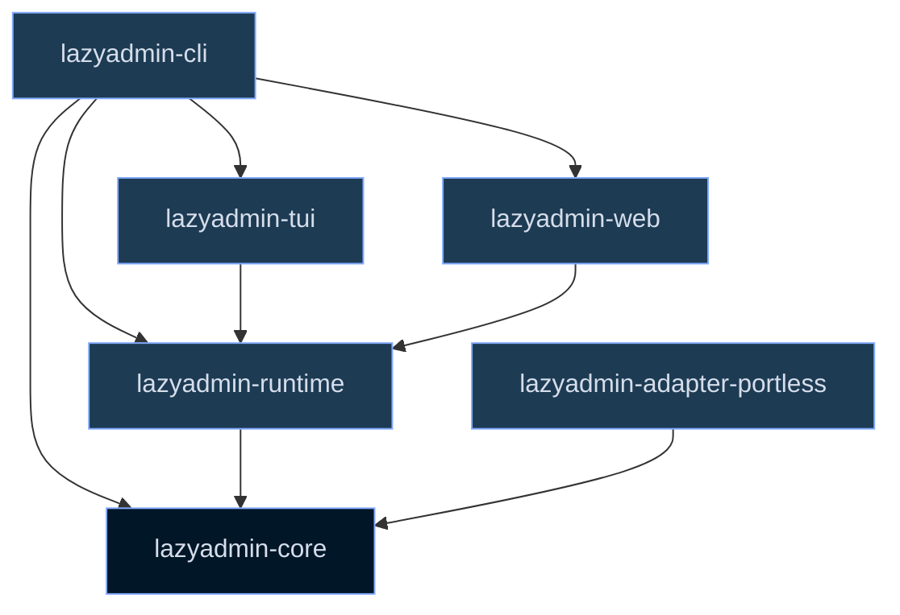

# Architecture

## Overview

lazyadmin is a Rust workspace with a core-first design: all runtime
discovery, correlation, and JSON schema contracts live in
`lazyadmin-core`. UI crates (TUI, Web) are projections of core
snapshots and never duplicate ownership or correlation logic.

## Workspace structure



| Crate | Responsibility |
|-------|--------------|
| `lazyadmin-core` | Normalized graph models, correlation, action plans/dry-run rendering, config loader, redaction, selectors, snapshot/diff/event JSON contracts, telemetry primitives |
| `lazyadmin-cli` | Clap command skeleton, human/JSON output formatting, host-state action execution |
| `lazyadmin-adapter-portless` | Read-only portless route discovery for `PORTLESS_STATE_DIR`, `~/.portless`, and legacy `/tmp/portless` state |
| `lazyadmin-tui` | Ratatui interface: responsive rendering, theme/keybinding support, Process Tree, Metrics, and interaction state |
| `lazyadmin-runtime` | Shared snapshot/event assembly and view-model projections: `Digest`, `DoctorGroups`, `HeaderPip`, `InspectorView`, global search, listener tables, relation lookups, and live snapshot feeds |
| `lazyadmin-web` | Loopback-only Axum server, embedded static app (`index.html`, `app.css`, `app.js`), read-only API routes |

## Data flow

1. **Discovery** — Adapters scan `/proc/net`, systemd D-Bus, Docker Engine
   API, and portless state. Each adapter emits its own representation
   of listeners, workloads, and managers.

2. **Correlation** — The core correlation pass matches PIDs to sockets,
   sockets to containers, processes to systemd units, and everything
   to projects. It produces a normalized graph with `Provenance` on
   every claim.

3. **Snapshot** — The correlated graph is serialized as
   `lazyadmin.snapshot.v1` JSON. This is the authoritative state
   consumed by all UIs.

4. **Projection** — `lazyadmin-runtime` builds view-models from the
   snapshot: `Digest` for overview, `DoctorGroups` for warnings,
   `InspectorView` for per-entity detail, `HeaderPip` for status,
   `SearchResults` for global search, and `ListenerTable` for shared
   listener row facts. Reusable relation facts live in
   `SnapshotRelations` so digest, search, inspector, and listener-table
   code do not each rediscover owner/project/manager labels.

5. **Render** — TUI and Web UI render the view-models. The TUI uses
   Ratatui widgets; the Web UI uses the embedded static app calling
   read-only API routes that return the same view-models.

6. **Refresh** — Long-lived surfaces use
   `lazyadmin_runtime::spawn_live_snapshot_feed`. Discovery events are
   treated as refresh hints and periodic snapshot polling remains
   authoritative.

## Action planning and execution

Action descriptions and dry-run text live in `lazyadmin-core::actions`.
The pure free-port planner is reusable by CLI, TUI, Web, and agents, and
inspector previews read the first line of the same dry-run output rather
than duplicating command strings in UI code.

Execution stays outside core. CLI/runtime layers own host-state work:
confirmation prompts, live rescans, process-key revalidation, signals,
manager APIs, and post-action verification. This keeps pure planning
testable while preserving conservative runtime safety.

## Adapter protocol

Adapters implement a common scan contract:

- `scan()` returns adapter-specific listeners, workloads, and managers.
- Each entity carries `Provenance` with `adapter`, `claim`, `evidence`,
  `confidence`, and `timestamp`.
- Confidence signals classify the adapter into a fixed enum:
  `ProcfsPidInode`, `ContainerInspect`, `CgroupCorrelation`,
  `ManagerAttribution`, `TrackedRunRegistry`, `PortlessRoutes`,
  `BestEffort`.

See [adapter-protocol.md](adapter-protocol.md) for the full contract.

Adapters include:

| Adapter | Source | State |
|---------|--------|-------|
| procfs | `/proc/net/tcp`, `/proc/net/udp`, `/proc/*/fd` | polling |
| systemd | D-Bus Manager interface | dbus_signals |
| container | Docker Engine API `/events`, container inspect | docker_events |
| portless | `routes.json`, `~/.portless` | polling |
| tracked | `/run/user/$UID/lazyadmin/runs` | registry |

## Snapshot and diff schemas

### Snapshot (`lazyadmin.snapshot.v1`)

- `host`: boot_id, hostname, kernel
- `managers`: systemd, Docker, portless, tracked-run registry
- `listeners`: TCP/UDP/Unix sockets with owner, exposure, confidence
- `workloads`: containers, systemd units, tracked runs
- `processes`: PID, command line, environment, open files
- `projects`: detected project roots with metadata
- `warnings`: correlation warnings (conflicts, orphans, unowned)

### Diff (`lazyadmin.diff.v1`)

Compares two snapshots and reports:

- `listeners`: added, removed, changed (by bind + protocol)
- `workloads`: added, removed, changed (by ID)
- `owner_changes`: PID-to-listener reassignments
- `warning_changes`: new, resolved, or changed warnings
- `summaries`: human-readable deltas

### Discovery events (`lazyadmin.discovery_event.v1`)

Adapters emit events as refresh hints:

- `kind`: heartbeat, added, removed, changed
- `adapter`: procfs, container, systemd, portless, tracked
- `timestamp`: ISO 8601

The TUI and Web UI treat events as hints; periodic snapshot polling
remains authoritative.

## Telemetry

lazyadmin emits structured `tracing` spans and events with stable IDs:

- Every adapter scan gets a span with duration
- Every correlation pass gets a span with entity counts
- Every action plan/execution gets a span with danger level and result
- CLI commands, TUI refreshes, and log streams are all instrumented

In production deployments, telemetry flows to Maple Ingest (`:3474`,
OTLP HTTP), through the OTEL collector, to Tinybird for analytics.
See the AGENTS.md telemetry-first standard for implementation
expectations.

## Build and validation

```bash
cargo metadata --format-version=1
cargo test --workspace
cargo fmt --all -- --check
cargo clippy --workspace --all-targets -- -D warnings
cargo run -p lazyadmin-cli -- --help
cargo run -p lazyadmin-cli -- export --json
cargo run -p lazyadmin-cli -- doctor --json
cargo run -p lazyadmin-cli -- overview --json
cargo run -p lazyadmin-cli -- search hermes --json
cargo run -p lazyadmin-cli -- diff testdata/snapshots/empty.json testdata/snapshots/empty.json --json
cargo run -p lazyadmin-cli -- tui --headless --json
cargo test -p lazyadmin-tui render_views
cargo test -p lazyadmin-tui live_refresh
cargo test -p lazyadmin-runtime -p lazyadmin-web
```

The workspace uses `resolver = "2"`, edition 2024, and requires Rust
1.85+. Integration tests are gated behind `--features integration-linux`
and `--features integration-portless`.
